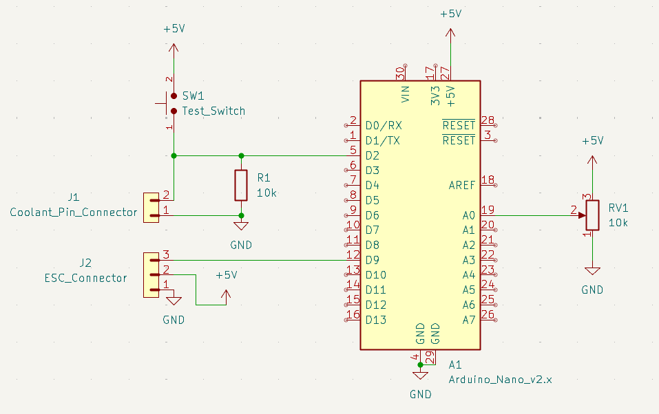
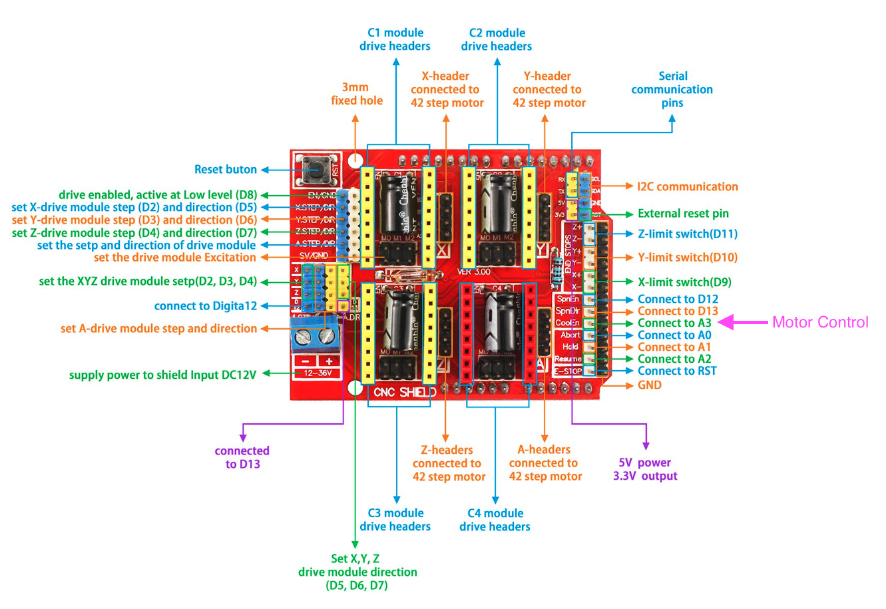

# TimSav Motor Driver 

The EdwardERC TimSav is a CNC cutter for foamboard that uses a needle connected to a motor to cut the board.
It uses a servo to raise and lower the needle (Z-axis). This is accomplished by repurposing the spindle speed 
as a PWM output for the servo.  Unfortunately, GRBL only supports one PWM output, so this means the motor has 
to be turned on by hand using a servo tester. 

This project allows the motor to be controlled with GRBL by repurposing the coolant function to act as a toggle.
It uses a second Arduino to listen for the mode input to turn the motor on or off. 

This project does not allow the CNC Shield to control the speed of the motor. That is set by the user using the 
potentiometer. 

## How to use
- To turn the motor on, Add an `M8` command to the start of the G-code.
- To turn the motor off, Add an `M9` command to the end of the G-code.
- I have modified the Timsav-Inskcape plugin to add the `M8` and `M9` commands to the G-code.
 - [Modified TimSav Inkscape Plugin](https://github.com/DavidJJ/inkscape-timsav/tree/FEATURE/Cooling-as-motor-controller) 

## Built For
- Board: Arduino Nano (ATmega328P)
- Framework: Arduino
- PlatformIO environment: `env:nanoatmega328`

## Behavior
- PWM output: pin 9 via Servo library (~50 Hz refresh)
- Mode input: digital pin 2
  - HIGH: Turn the motor on according to the speed set by the potentiometer.
  - LOW: Turn the motor off.

## Pulse Width Range
- Potentiometer maps to 1000us - 2000us
- Limits can be adjusted in `src/main.cpp`

## Wiring
- Potentiometer
  - wiper to A0, 
  - one end to +5V 
  - one end to GND
- Mode input to D2 
  - 10k ohm pull-down resistor from D2 to GND.
  - Coolant Pin on the CNC shield `CoolEn A3` connects to D2 on Arduino `J1 Pin 2`  
  - Ground pin on the CNC Shiled `GND` connects to GND on Arduino `J1 Pin 1`
- ESC output
  - D9 to ESC signal output `J2 Pin 3`
  - +5V to middle pin of `J2 Pin 2`
  - GND to outside pin of `J2 Pin 1`
- Test Button (Optional)
  - +5V to pin 1 of the test button
  - D2 to pin 2 of the test button

## Diagram



## Build/Upload
```sh
pio run # build project
pio run -t upload # upload to board
```

## Monitor serial connection
```sh
pio device monitor
```

## Links
 - [TimSav](https://www.etsy.com/listing/1374647661/erc-timsav-cheap-diy-cnc-foamboard)
 - [Modified design](https://www.thingiverse.com/thing:5442906)
 - [Inkscape Plugin](https://github.com/DavidJJ/inkscape-timsav/tree/FEATURE/Cooling-as-motor-controller)